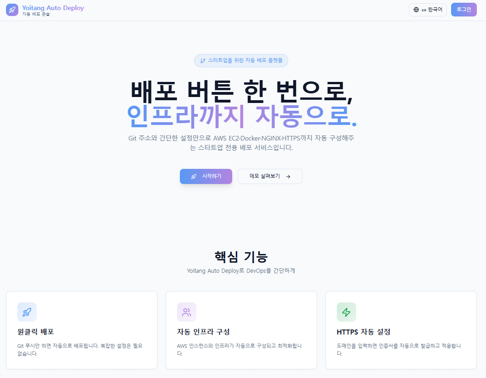

> 🏆 2025 SoftBank Global Hackathon (Korea) — 2차 예선 **최우수상 수상작**


<h1 align="center">Yoitang Auto Deploy</h1>

<p align="center">
  <b>배포 버튼 한 번으로, 인프라까지 자동으로.</b><br/>
  Git 주소와 간단한 설정만으로 AWS EC2 · Docker · NGINX · HTTPS까지 자동 구성해주는 스타트업 전용 자동 배포 플랫폼
</p>

<p align="center">
  
  
  
  
  
</p>

<p align="center">
  
</p>

---

## 📌 소개 (Introduction)

**Yoitang Auto Deploy** 는 스타트업과 작은 개발팀을 위해 만든 **원클릭 자동 배포 플랫폼**입니다.

개발자는 단지 다음 정보만 입력합니다.

- Git 저장소 URL
- 배포 브랜치
- (필요 시) GitHub PAT
- 서비스 이름 / 팀 이름
- 도메인 prefix

이후의 과정은 플랫폼이 대신 처리합니다.

- EC2 인스턴스 3대로 구성된 **k3s 멀티 컨트롤 플레인 클러스터**에 배포
- Jenkins + Kaniko로 컨테이너 이미지 빌드 및 AWS ECR Push
- NGINX Ingress + cert-manager로 HTTPS 자동 발급/적용
- Prometheus + Grafana 기반 모니터링 및 리소스/비용 대시보드 제공

---

## ✨ 핵심 기능 (Features)

<p align="center">
  
</p>


- 🪄 **원클릭 배포**
  - Git URL, 브랜치, PAT, 도메인만 입력하면 배포 파이프라인이 자동 생성됩니다.
- ⚙️ **자동 인프라 구성**
  - EC2 3대에 k3s 멀티 컨트롤 플레인을 구성해 고가용성을 확보합니다.
- 🔑 **Private Repo 지원**
  - GitHub PAT을 이용해 Private Repository도 안전하게 빌드합니다.
- 🔁 **파이프라인 단계별 로그**
  - Git Clone, Build & Test, Docker Build & Push, k3s Deploy, Health Check 로그를 UI에서 확인할 수 있습니다.
- 📊 **서비스 메트릭 및 비용 대시보드**
  - CPU/메모리 사용량, 최근 배포 이력, 일간 예상 비용 등을 시각화합니다.
- 🔐 **HTTPS 자동 설정**
  - 도메인 prefix만 입력하면 Let’s Encrypt 인증서를 자동 발급·적용합니다.

---

## 🖥 UI 미리보기 (Preview)

### 1. 새 서비스 만들기 플로우

| 기본 정보 | Git 설정 | 요약 & 배포 |
| --- | --- | --- |
|  |  |  |

---

### 2. 서비스 대시보드

| 전체 대시보드 | 파이프라인 상세 |
| --- | --- |
|  |  |

---

### 3. 메트릭 대시보드

<p align="center">
  
</p>

---

## 🏗 전체 아키텍처 (Architecture)

### 인프라 개요

- **EC2 노드**
  - `k3s-server-1` : k3s control-plane
  - `k3s-server-2` : k3s control-plane
  - `k3s-server-3` : k3s control-plane (+ worker 역할 겸용 가능)
- **CI 노드 (별도 EC2)**
  - Docker Compose로 **Jenkins, Backend API, Postgres, Nginx** 를 실행
  - Jenkins에서 Kaniko 컨테이너를 이용해 ECR로 이미지 푸시

```text
Developer
   |
   | 1. Git URL / 브랜치 / PAT / 도메인 prefix 입력
   v
Frontend (Next.js)
   |
   | 2. REST 호출
   v
Backend API (FastAPI)
   |
   | 3. Jenkins REST API 호출 (Job Trigger)
   v
Jenkins (CI, Docker Compose)
   |
   | 4. Kaniko로 Docker 이미지 빌드 & ECR Push
   v
AWS ECR (Image Registry)
   |
   | 5. k3s가 새 이미지 Pull
   v
k3s Cluster (Multi Control-Plane, 3 EC2)
   ├── Deployment / Service
   ├── Nginx Ingress (yoitang.cloud)
   ├── cert-manager (Let's Encrypt)
   ├── kubecost
   └── Prometheus + Grafana

```
## 🧰 기술 스택 (Tech Stack)
### Frontend

Next.js (React + TypeScript)

Tailwind CSS, shadcn/ui

Zustand 등 상태 관리

Vite 관련 설정 일부 사용 (개발 편의)

### Backend

FastAPI (Python 3.11)

SQLAlchemy, psycopg2, PostgreSQL

boto3 (AWS 연동)

httpx / requests

### Infra & DevOps

AWS EC2

Docker, Docker Compose

Jenkins

레포 루트의 Jenkinsfile: CI 노드 전체(docker-compose 기반) 빌드/배포 용

infra/Jenkinsfile: 팀 서비스 컨테이너 이미지 빌드 + ECR Push + k3s 배포 용

Kaniko (컨테이너 이미지 빌드)

AWS ECR (이미지 레지스트리)

k3s (Multi-Control-Plane Kubernetes)

Nginx Ingress + cert-manager (HTTPS)

Prometheus + Grafana (모니터링 & 메트릭)

## 🔁 배포 파이프라인 흐름

infra/Jenkinsfile 기준

### 1. Checkout

파라미터로 입력받은 GIT_REPO, BRANCH, GIT_PAT를 사용해 app/ 디렉터리에 팀 레포를 clone

### 2. Detect Frontend Stack & Build

frontend/package.json 기준으로 npm install, npm run build 등 실행

ESLint 설정이 있으면 자동으로 lint 수행

### 3. ECR Login (Kaniko용 Docker Config 생성)

### 4. Kaniko Build & Push

Jenkins 컨테이너 바깥의 jenkins_home를 마운트해 Dockerfile 기반 이미지 빌드

${ECR_REGISTRY}/${ECR_REPO}:${PREFIX}-${BUILD_NUMBER} 형태로 Push

### 5. Trivy Scan

빌드된 이미지에 대해 취약점 스캔

### 6. k8s Manifest 생성 및 적용

네임스페이스, Deployment, Service, Ingress YAML을 동적으로 생성해 kubectl apply

팀별 네임스페이스와 도메인(prefix.yoitang.cloud)로 분리

### 7. Health Check

배포된 서비스의 헬스 체크 엔드포인트 호출


---

## 🏆 수상 경력 (Awards)

- **2025 SoftBank Global Hackathon (Korea)**
  - 🥇 예선 최우수상 (Top Excellence Award)
  - 작품: *Yoitang Auto Deploy*

